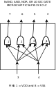
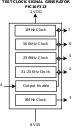

# JiggleSoft's Microchip PIC / AVR Logic Gates

## Introduction

Recently I had a requirement to create a 5 volt, TTL, through hole, home built circuit, but was hampered by the lack of appropriate discrete logic IC's. These IC's are disappearing fast and being replaced by SMD components. To the rescue comes Microchip's PIC CLC and Microchip's AVR CCL. These are effectively simple programable logic cells within the MCU and their combinational logic is not constrained by the MCU's clock.

For my initial requirement I needed as cheap (£) and as small as possible (pin count) DIP running at 5V and relatively fast speed propagation and rise/fall times. It must have two inputs and output the result of a NAND and a NOR operation. The cheapest/smallest PIC MCU that provided this functionality was a PIC16F15313. This repository is born out of this requirement and will probably be expanded as and when required with additional logic gates. The cost is comparable to existing DIP logic gates. The whole chip was given over to this functionality and the MCU apart from initial configuration of the CLCs the MCU is effectively redundant and put into SLEEP mode with only the CLCs active.

## Licensing

Copyright (C) 2020 Justin Lane.
See the [MIT Licence](LICENSE) file.

## Contact Us

Please email picavrgates@jigglesoft.co.uk regarding this repository.

## Logic Gate Index

| Name | MCU | Diagram | Description | Source | Firmware | KiCAD Library |
| ---- | --- | ------- | ----------- | ------ | -------- | ------------- |
| [nand-and-nor-or-gate-pic](nand-and-nor-or-gate-pic) | PIC16F15313 |   [PDF](nand-and-nor-or-gate-pic/doc/nand-and-nor-or-gate-pic-diagram.pdf) | 2 input with single output for each of the NAND, AND, NOR, OR logic functions. | [Goto](nand-and-nor-or-gate-pic/src/MPLABXProjects/nand-and-nor-or-gate-pic-mcc.X) | [Goto](nand-and-nor-or-gate-pic/src/MPLABXProjects/nand-and-nor-or-gate-pic-mcc.X/dist/default/production) | [Goto](nand-and-nor-or-gate-pic/eng/kicad/library) |

## Other Project

| Name | MCU | Diagram | Description | Source | Firmware | KiCAD Library |
| ---- | --- | ------- | ----------- | ------ | -------- | ------------- |
| [test-clock-signal-gen-pic](test-clock-signal-gen-pic) | PIC16F15313 |   [PDF](test-clock-signal-gen-pic/doc/test-clock-signal-gen-pic-diagram.pdf) | Output the following clock signals 32MHz, 1MHz, 500KHz, 250KHz, and 31.25KHz | [Goto](test-clock-signal-gen-pic/src/MPLABXProjects/test-clock-signal-gen-pic-mcc.X) | [Goto](test-clock-signal-gen-pic/src/MPLABXProjects/test-clock-signal-gen-pic-mcc.X/dist/default/production) | [Goto](test-clock-signal-gen-pic/eng/kicad/library) |

