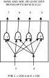

# JiggleSoft's Microchip PIC / AVR Logic Gates

## 2 INPUT -> NAND, AND, NOR, OR

### Description

2 input with single output for each of the NAND, AND, NOR, and OR logic functions.

### MCU

Microchip PIC16F15313

 * [Product Overview](https://www.microchip.com/wwwproducts/en/PIC16F15313)
 * [Datasheet](http://ww1.microchip.com/downloads/en/DeviceDoc/40001897A.pdf)

## Pin Out

| Pin | Signal | Direction | Notes    |
| --- | ------ | --------- | -------- |
|  1  | Vdd    | Power     | +5V Nom. |
|  2  | A      | Input     | A        |
|  3  | B      | Input     | B        |
|  4  | OR     | Output    | A + B    |
|  5  | NOR    | Output    | -(A + B) |
|  6  | AND    | Output    | A & B    |
|  7  | NAND   | Output    | -(A & B) |
|  8  | Vss    | Power     | 0V       |

# Logic Gate Diagram

 [Logic Gate Diagram](doc/nand-and-nor-or-gate-pic-diagram.pdf)

